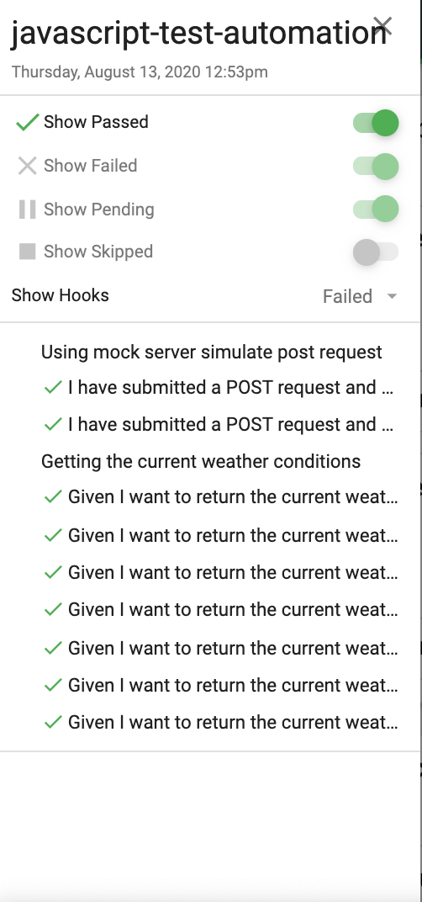

# API Automation of Weatherbit using javascript
## Key features:
* This api automation project is developed for testing the get current weather conditions feature for weatherbit.io. Following are the tech highlights: 
    * Programming language: javascript
    * Test framework: mocha
    * Assertion library: chai
    * Build tool: npm
    * Reporter: mochawesome
    * Mock server: json-server

* This project uses mocha js test framework for its BDD support and its flexibility to support different libraries for different purposes like assertions and reporting.
* This project uses json-server to create dummy api and data, for its simplicity to use.
* This project is dockerized to avoid lengthy installation steps for the consumer.

Scenario - Getting the current weather conditions: 
Given I want to return the current weather condition 
And {lat} is 40.730610 and {lon} is -73.935242 
When I navigate to current weather API
Then I should receive the correct payload and information

Test file tests/GetCurrentWeatherConditionsTest.js is developed and configured with data driven testing capabiilty to fetch different cases from data/testData.json.
 
tests/BooksMockAPITests.js is developed using Mock server called json-server. This test creates dummy data in data/mock-db.json using mock apis.

Scenario #2 - Using mock server simulate post request:
Given I've submitted a POST request and created a new entry in the mock server
When I attempt to retrieve the new record
Then I should receive a response with the new record and correct payload

* tests/BooksMockAPITests.js is developed using Mock server called json-server. This test creates dummy data in data/mock-db.json using mock apis.
apis/PostBooks.js creates the dummy data and apis/GetBooks.js fetches the dummy data created. BooksMockAPITests.js is the test file to validate this functionality. This test is also data driven from data/testData-mockapi.json

# Swagger documentation
https://app.swaggerhub.com/apis/vanitha1289/weatherbitapi/1.0#/default/get_current

    * Docker steps 
        ```
        docker build -t api-automation .
        docker run api-automation
        ```
    
## Installation/Pre-requisite
#### Dockerization as solution for OS agnostic test runs
This project is dockerized to avoid installation steps(which are OS specific) and to facilitate smooth running of tests. Below commands build and run the Dockerfile. (this includes running the tests in docker also)

```
docker build -t api-automation .
docker run api-automation
```

#### npm commands to run the tests

```
To run all the tests: npm run test
To run weatherbit api tests only: npm run test-weather
To run mock server tests only: npm run test-mock
```

## Run results
mochawesome reporter is used to generate html report of the test runs. Below is the sample screenshot of test results html.


## Future Enhancements
* Hook the tests to CI/CD pipeline to enable continous integration and development.
* Provide capability for code coverage to instrument the developement code and then run these tests to get coverage results achieved with the existing test suite.
* Use static code analysis
